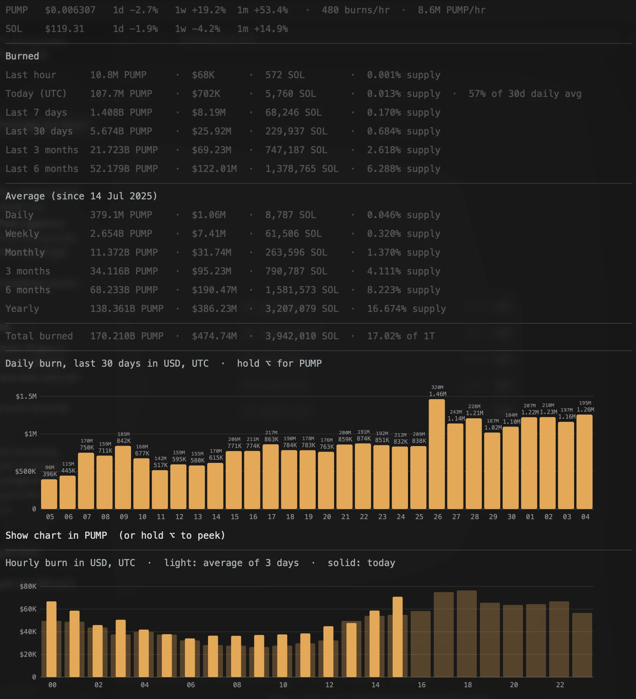

# PUMP buy & burn tracker

Tracks pump.fun's buy-and-burn programme on the Mac menu bar and on an iPhone
home screen widget. No API key, no server, no account.

> Informational tool. Not financial advice, not affiliated with pump.fun.



## What it shows

**Mac (SwiftBar menu bar)**

- PUMP and SOL price, with 1-day / 1-week / 1-month change, and the live burn rate
- PUMP burned in the last hour, today, last 7 / 30 days, last 3 / 6 months,
  each in PUMP, USD, SOL and % of supply
- Average burn per day, week, month, 3 months, 6 months and year
- Total burned, in PUMP, USD, SOL and % of the 1T supply
- Column chart of the last 30 days, in USD or PUMP: hold ⌥ to peek at the other
  unit, or click "Show chart in …" to switch
- Hourly burn by UTC hour: the average of the last 30 days, with today on top

**iPhone (Scriptable, large widget)**

- PUMP burned today, with USD, SOL and the pace against the 30-day average (scaled to the time of day)
- Yesterday, last 7 and last 30 days, in PUMP, USD and % of supply
- Column chart of the last 30 days
- Total burned, PUMP price and live burn rate

## Where the numbers come from

Everything is fetched from the device the widget runs on. Nothing goes through
a server of ours.

| What | Source | How often |
|---|---|---|
| Daily burns (PUMP, USD, SOL), since July 2025 | [pump.fun/pump-token](https://pump.fun/pump-token), the page's own daily table | at most once an hour |
| PUMP supply, burn transactions per hour | Solana public RPC | every refresh |
| PUMP and SOL price, 24h change | Jupiter price API | every refresh |

pump.fun has no public API for its daily table, but the page carries the whole
series in its HTML. The widget reads it from there, keeps the last good copy,
and falls back to a copy embedded in the script if the page can't be read. If
pump.fun changes the page, the history simply stops updating. Supply, prices and
today's live total keep working.

**Today** is pump.fun's figure at the last page fetch, plus the drop in PUMP
supply since then. Supply only goes down through burns, so this is exact even
if the device was asleep in between.

## The addresses it watches

Published by pump.fun and verified on-chain:

| | |
|---|---|
| PUMP mint (Token-2022) | `pumpCmXqMfrsAkQ5r49WcJnRayYRqmXz6ae8H7H9Dfn` |
| Burner wallet (primary) | `99mRw3EzdJZWEUjgp1nrU4WeHsukUBjbh7gYE7pm4F3c` |
| Burner wallet (secondary) | `9jHrTCwpDANHLNQz5cem6XLUBM8KiTWKe766Br6KVCXM` |

Each cycle is two transactions ~2 seconds apart: a market buy routed through
Jupiter into the PumpSwap pool, then a `BurnChecked` on Token-2022 that
permanently reduces the mint supply. The mint authority is `null`, so nothing
can be re-issued.

## Install — Mac

Needs [SwiftBar](https://github.com/swiftbar/SwiftBar) and Node.js 18 or newer.

```
brew install --cask swiftbar
brew install node
```

On first launch SwiftBar asks for a plugin folder. Put `mac/pumpburn.5m.js` in
it and make it executable:

```
chmod +x /path/to/your/plugin/folder/pumpburn.5m.js
```

The plugin finds Node on its own (Homebrew, Volta or nvm), so it works even
though SwiftBar starts plugins with a minimal `PATH`. If it can't find Node, the
menu bar says so.

The `5m` in the filename is the refresh interval: rename it to `1m`, `15m` etc.
to change it. Local state lives in `~/Library/Application Support/PumpBurn/`.

## Install — iPhone

1. Install [Scriptable](https://apps.apple.com/app/scriptable/id1405459188) (free).
2. Open it, tap `+`, paste all of `PumpBurnWidget.js`, name it `PumpBurnWidget`.
3. Long-press the home screen → `+` → Scriptable → **Large** widget.
4. Long-press the new widget → Edit Widget → choose `PumpBurnWidget`.

iOS decides when widgets refresh, usually every 15–30 minutes.

## Optional: your own RPC

Both scripts default to Solana's public endpoint, which is rate-limited and not
meant for production use. It is fine for a widget, but for something steadier
get a free key at helius.dev:

- iPhone: edit the `RPC` constant at the top of the script.
- Mac: edit the `RPC` line near the top of `pumpburn.5m.js`, or set
  `PUMP_RPC="https://mainnet.helius-rpc.com/?api-key=..."` in SwiftBar's
  environment.

## Known limits

- **Days are UTC**, matching pump.fun's table, so "today" rolls over at
  00:00 UTC.
- **1w and 1m price change** compare the current price with pump.fun's average
  buyback price on that day (USD spent ÷ PUMP bought), not a closing price.
  1d is Jupiter's 24-hour change.
- **Averages** use the whole published history. Early days burned more PUMP
  per day than now, so the PUMP averages sit above the recent daily pace.
- **Last hour** needs a snapshot from about an hour ago, so it shows `—` for
  the first hour after the Mac wakes up.
- **Burns/hr** is measured over the burner's last 300 transactions (about 15–20
  minutes). **PUMP/hr** is the supply drop between the last two refreshes on
  the Mac, and over the last two hours on the iPhone.
- **The hourly chart is measured by the plugin itself** from the supply every
  refresh, because no source publishes hourly figures. When the Mac was asleep,
  the next refresh rebuilds the missing hours (up to 72 h back): the PUMP burned
  across the gap is exact, and it is spread over the hours in proportion to the
  burner wallets' transactions, so those hours are an estimate. The first refresh
  after a long sleep takes up to about a minute.
- **The charts need SwiftBar.** They are SVG images, which xbar may not render.
- **Local state** (snapshots, the cached daily series and the chart setting)
  stays on the device:
  `~/Library/Application Support/PumpBurn/` on the Mac, Scriptable's documents
  folder on the iPhone.

## Files

| | |
|---|---|
| `mac/pumpburn.5m.js` | SwiftBar plugin, Mac menu bar |
| `PumpBurnWidget.js` | Scriptable widget, iPhone |
| `test-logic.mjs` | Tests for the logic both scripts share: `node test-logic.mjs` |
| `pump-buyburn.mjs` | CLI: dumps individual buy and burn transactions to CSV |
| `buyburn.csv` | Sample output of `pump-buyburn.mjs` |
| `cadence.mjs` | CLI: measures how often the burner fires, by hour |
